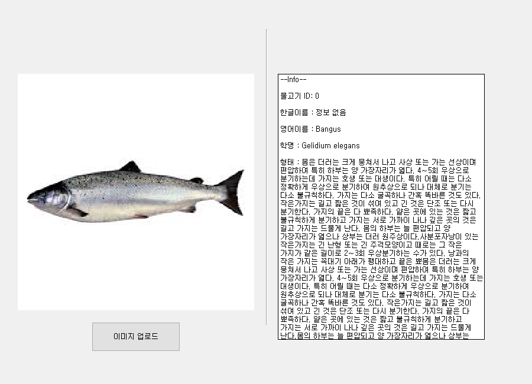

# TheFish — AI 해양생물 분류 및 백과사전

> 이미지를 올리면 ResNet50 전이학습 모델이 어종을 분류하고, SQLite 백과사전에서 해당 어종 정보를 보여주는 데스크톱 앱. 2023 ICT이노베이션스퀘어 동아리(팀 "쌀과자가 좋아", 4인).

## 무엇인가

이미지 업로드 → ResNet50 분류(40클래스) → 어종 정보 출력의 단일 데스크톱 앱이다.
자체 CNN이 클래스 증가 시 정확도가 떨어져 ResNet50 전이학습으로 전환, 40+ 클래스 분류를 달성했다. 이미지 수집엔 [AutoCrawler](https://github.com/YoongiKim/AutoCrawler)를 사용했다.

## 구성

| 경로 | 설명 |
|---|---|
| `test/ptqttest1.py` | 메인 앱 (PyQt5) — 이미지 분류 + 어종 정보 출력 |
| `test/FishDicDB.db` | 어종 백과사전 SQLite DB |
| `models/resnet50_checkpoint.pth` | 학습된 ResNet50 체크포인트 (90MB) |
| `src/학습.py` | ResNet50 전이학습 스크립트 (ImageFolder 기반) |
| `src/Organizer.py` | 데이터셋 train/val/test 분할 도구 |
| `app.py`, `Prj.py` | PySide6 GUI 프로토타입 — 별도 실험본, 메인 앱과 미통합 |
| `test/ptqttest1.spec` | PyInstaller 배포 스펙 |

학습 이미지 데이터셋(웹 크롤링 수집)과 활동 보고서는 저장소에 넣지 않고 로컬 `data/`, `archive/`에 보관한다.

## 실행

Python 3.13 기준 (torch는 CPU 빌드):

```bash
pip install torch torchvision --index-url https://download.pytorch.org/whl/cpu
pip install -r requirements.txt
cd test
python ptqttest1.py
```

torch를 PyQt5보다 먼저 import해야 DLL 충돌이 없다.

## 결과



2026-07 Python 3.13 + torch 2.x(CPU)에서 동작 확인 — 이미지 업로드 → ResNet50 분류 → SQLite 백과사전 표시까지 전체 플로우 정상.

## 상태

- 2023 동아리 프로젝트 종료 후 보존 — GUI 프로토타입·데이터셋은 구글드라이브 백업(E드라이브)에서 복원 (2026-07)
- 2026-07 정비: requirements를 실동작 세트로 현행화, 학습 스크립트 저장 경로 로컬화(Colab 잔재 제거), IDE 설정 추적 해제
- PySide6 프로토타입(`app.py`)은 분류 추론이 연결되지 않은 UI 실험본 — 통합하지 않고 보존
- 모델 체크포인트(90MB)는 저장소에 직접 포함 (LFS 미전환 — 히스토리 유지 우선)
